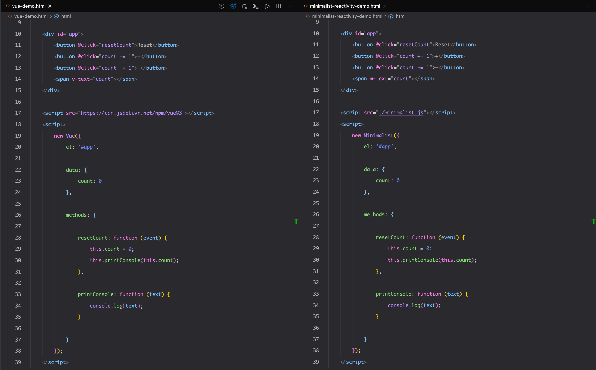

# Custom Reactivity Demo

This repo tries to implement basic reactivity with Vue-like syntax.

Demo Url: [https://focused-northcutt-897d63.netlify.app/minimalist-reactivity-demo.html](https://focused-northcutt-897d63.netlify.app/minimalist-reactivity-demo.html)

This implementation is based on the concepts taught by [Caleb Porzio](https://twitter.com/calebporzio) in [Building AlpineJS](https://laracasts.com/series/building-alpinejs) series.